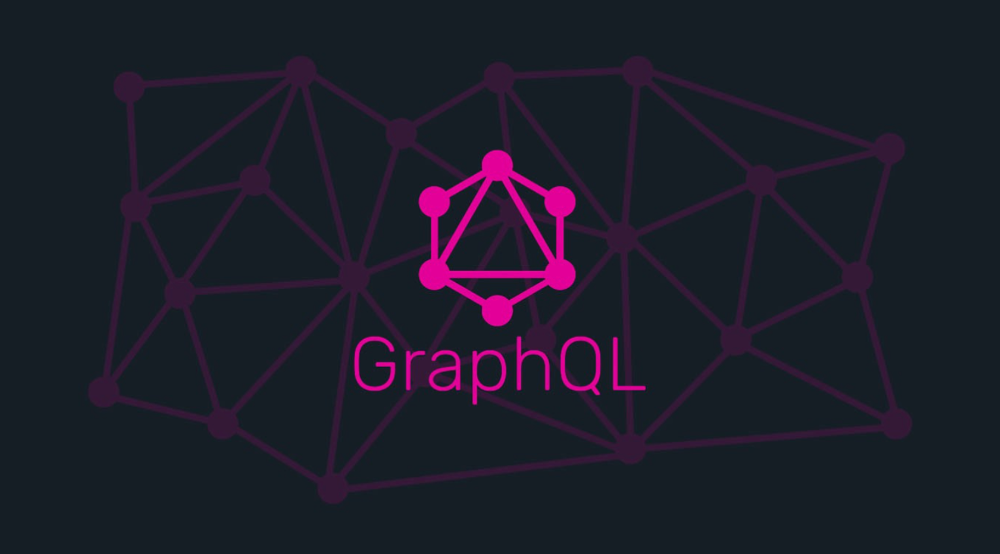

# learning-GraphQL Jangwon

### 웹 앱 API 개발을 위한 GraphQL 책과 GraphQL을 학습

    

* 책과 GraphQL의 공식 Documentation을 기반으로 학습하며 향후 간단한 프로젝트 또한 넣을 생각입니다. 
* 학습한것을 작성하면서 Reference는 꼭 남기려고 합니다.

## 🐰학습 기록 

|            chapter            |             링크             |
| :---------------------------: | :--------------------------: |
|    Chapter1. GraphQL 개념     | [:link:](./record/Chapter1/) |
| Chapter2. GraphQL 그래프 이론 |     [:link:](./record/)      |
|    Chapter3. GraphQL 쿼리     |     [:link:](./record/)      |
| Chapter4. GraphQL 스키마 설계 |     [:link:](./record/)      |
|     Chapter5. GraphQL API     |      [:link:](./record)      |
| Chapter6. GraphQL 클라이언트  |      [:link:](./record)      |

